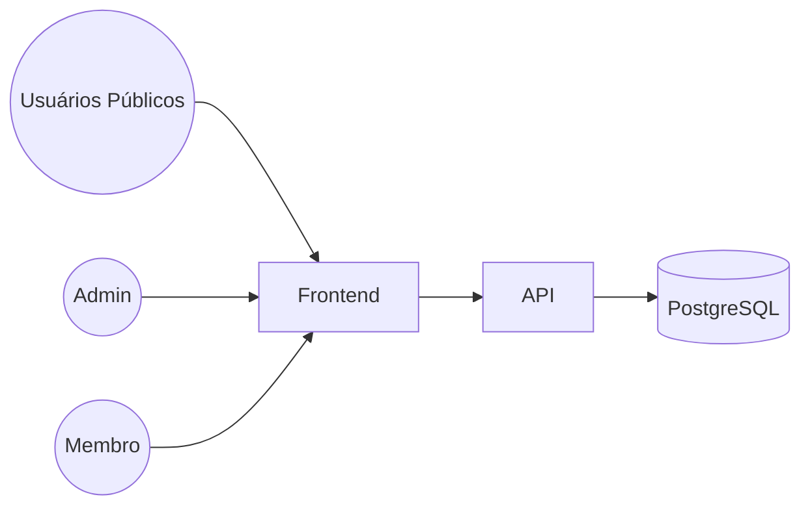

# Documento de Arquitetura

## 1. Visão Geral

O sistema tem como objetivo gerenciar um grupo de networking. Pessoas interessadas podem enviar uma intenção de participação. Um administrador avalia as intenções, aprova ou rejeita e, ao aprovar, gera um convite para cadastro. Membros podem acessar avisos, registrar presença em reuniões, criar e acompanhar indicações, agradecer negócios fechados e acompanhar métricas. Administradores também podem gerenciar mensalidades.

## 2. Diagrama da Arquitetura



## 3. Modelo de Dados

### Tabelas Principais

* **members**: id, name, email, phone, role, status
* **intentions**: id, name, email, phone, message, status
* **invitations**: id, intention_id, token, expires_at, used
* **announcements**: id, title, body, pinned, created_by
* **meetings**: id, title, meeting_date, location, notes
* **meeting_attendance**: id, meeting_id, member_id, checked_in_at
* **referrals**: id, author_id, target_id, company, description, status
* **gratitudes**: id, referral_id, author_id, message
* **payments**: id, member_id, amount, due_date, paid_date, status

### Relacionamentos

* members 1:N announcements
* members 1:N referrals (author)
* members 1:N referrals (target)
* referrals 1:N gratitudes
* meetings 1:N meeting_attendance
* members 1:N meeting_attendance
* intentions 1:N invitations
* invitations 1:1 members
* members 1:N payments

## 4. Estrutura de Componentes (Frontend)

```
/app
  /intent                # Formulário público
  /invite/[token]        # Cadastro via convite
  /login                 # Login
  /admin
    /intentions          # Aprovação
    /announcements       # Avisos
    /payments            # Financeiro
    page.tsx             # Dashboard admin
  /member
    /dashboard           # Dashboard membro
    /announcements       # Avisos
    /meetings            # Reuniões
    /referrals           # Indicações
    /gratitudes          # Obrigados
    /payments            # Financeiro

/components
  /ui
  FormIntent
  ListIntentions
  DashboardMember
```

## 5. Definição da API (exemplos)

### Criar intenção

**POST /api/intentions**

```
Request: { name, email, phone, message }
Response: { id, status }
```

### Aprovar/Rejeitar intenção

**POST /api/intentions/:id/decision**

```
Request: { action, admin_note }
Response: { invitation? }
```

### Cadastro via token

**POST /api/invitations/:token/register**

```
Request: { name, email, phone, company }
Response: { member_id }
```

## 6. Fluxo Implementado

Fluxo escolhido:

1. Usuário envia intenção
2. Admin aprova intenção e gera token
3. Usuário completa cadastro via token e vira membro
4. Redireciona para área do membro (/member)
